# ICML 15337 submission: Supplementary results of the proposed DEG in the rebuttal period

___

## Section1. Updating the reward diagram.

We further clarify the meanings of different symbols in the schematic diagram to illustrate (i) the differences between the two sub-rewards when applied to the same trajectory, and (ii) how each reward functions across different kinds of trajectories.

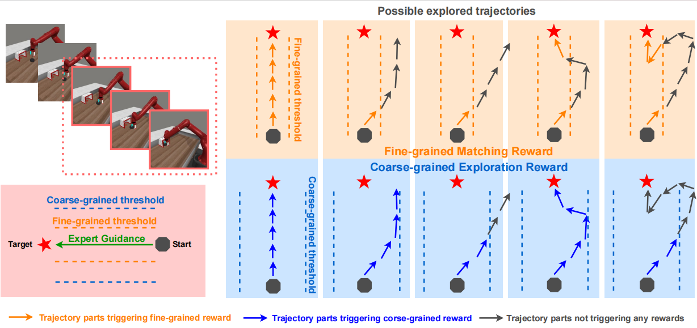

___

## Section2. More detailed encoder analysis.

We further provide more results and analysis on the DEG contrastive encoder and pre-trained DINOv3. We first present the performance of DINOv3 on video sequences with different frame intervals. DINOv3 exhibits slightly increased discrimination for frames with larger intervals (i.e., larger semantic distances), but the color distributions remain highly similar, indicating that it cannot adequately map semantic distances to similarity differences. In addition, the average cosine similarity of the first 11 semantically consistent real–generated image pairs encoded by DINOv3 is **0.9384 (far from 1)**, which means it suffers from the noise in generated videos. These disadvantages makes DINOv3 unsuitable for similarity-based reward design. 

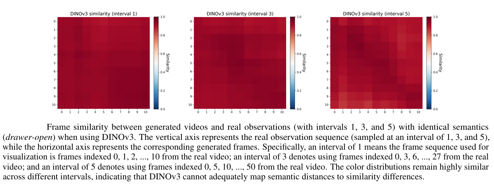

In contrast, the DEG contrastive encoder shows significantly stronger discrimination for frame sequences with larger intervals, while maintaining the ability to align semantically identical frames over a wider temporal range. The first 11 semantically consistent real–generated image pairs encoded by DEG encoder is **0.9952**. Furthermore, for frames that are semantically close but distinct, DEG can effectively map their semantic distance to the similarity difference (heatmap of interval 1), thereby supporting the design of the proposed dual-granularity reward with different thresholds.

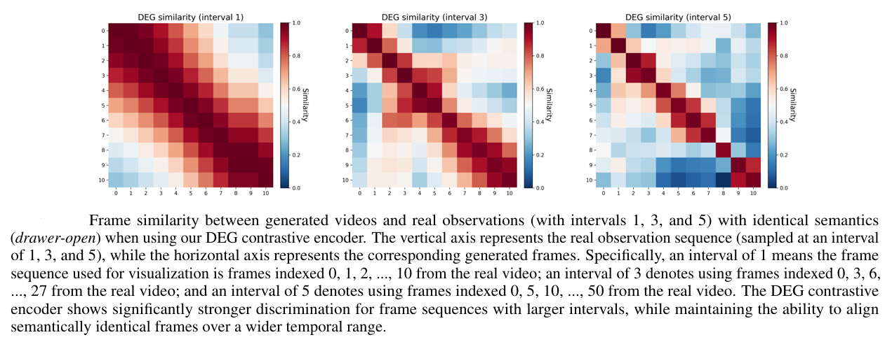

In summary, DEG encoder can better align frames with similar semantics and well map the semantic distances between different frames to their latent distances.

___

## Section3. DEG is robust to both seen and unseen episodes (initial states).

We visualize the used expert videos and generated RL episodes when faced with both seen and unseen initial states. DEG can well handle ood episodes and generates qualified RL gudiance.

Simulation:
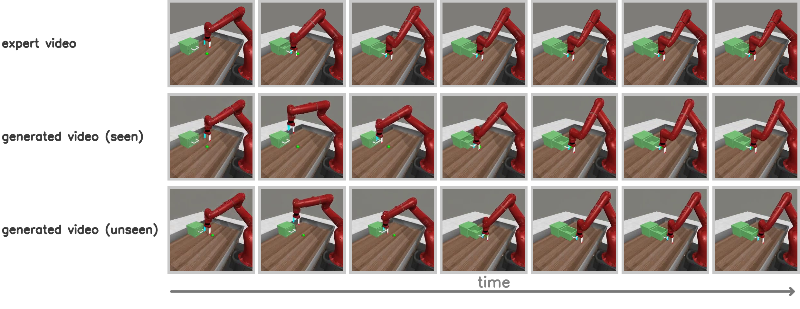

Real-world tasks:
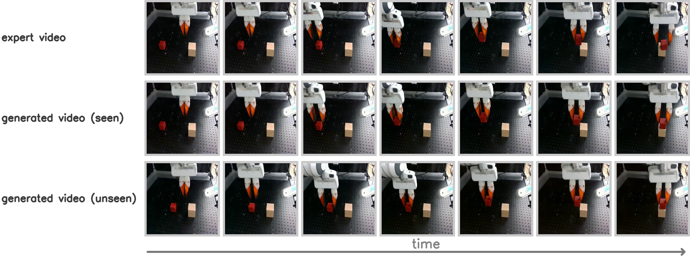

___

## Section4. Hyper-parameters sensitivity experiments.

Regarding the coefficients among different rewards, our goal was to scale them to a similar order of magnitude (range from 10 to 100), which results in good performance. We first change the weighing between coarse-grained reward and fine-grained reward in DEG, the results below demonstrate that a similar order of magnitude can better scale these two terms.

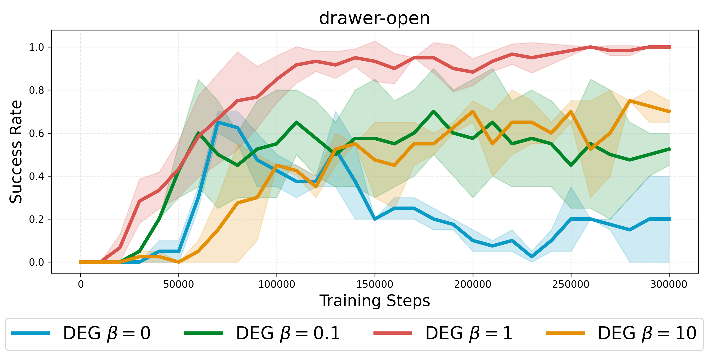

Then, we change the coefficient of the success sparse reward in DEG+ (DEG+ = DEG + success sparse reward), as shown below. The larger weights results in better performance, which is consistent with our intuitation, while 10 is enough for effective learning.

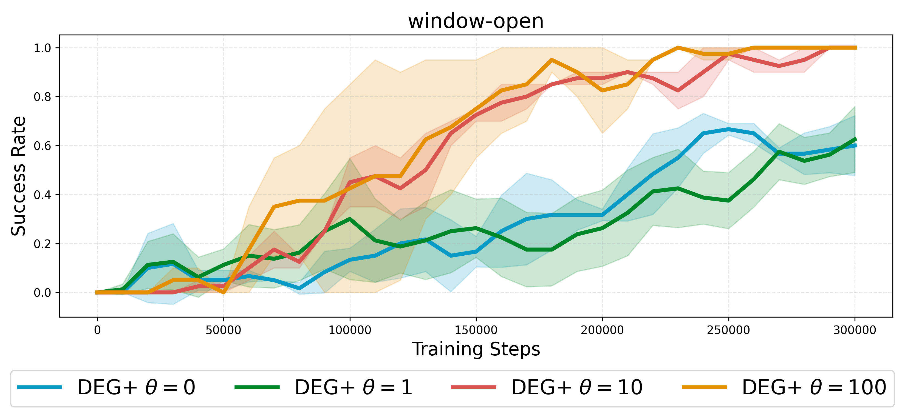

___

## Section5. Prompt sensitivity experiments.

In the original paper, we provided as detailed a prompt as possible to maximize generation quality and verify the novel idea of using a large video generation model as an RL guide. In this section, we further conduct fine-tuning with very simple prompts. DEG and DEG+ (DEG with success sparse reward) can still perform effective RL guidance with very brief prompts ‘open the drawer’ and 'push the coffee machine button'.

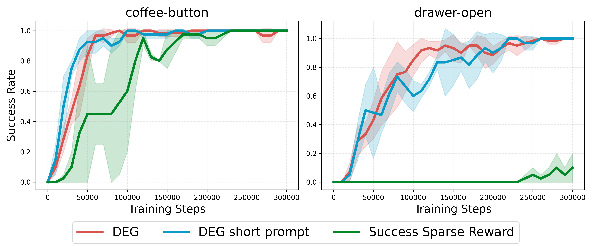
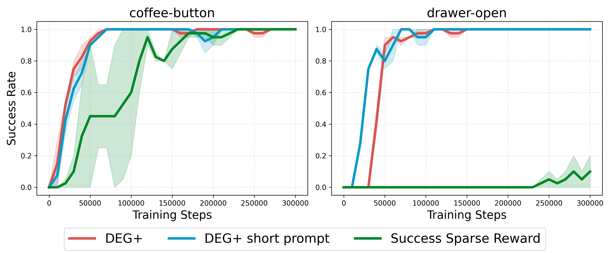

___

## Section6. Experiments on harder tasks without success sparse rewards.

DEG still performs better than baselines on harder tasks without success sparse rewards.
| task | DEG | diffusion reward | viper|
|-|-|-|-|
| button-press-topdown    |  **0.60** | 0.33       |0.00|
|assembly|**0.37**| 0.00| 0.00 |

___

## Section7. Direct comparison between DEG and DEG+.

We include the DEG results in the DEG+ (DEG with success sparse reward) figure and directly compare them. With success sparse reward, our method can perform much better, which is consistent with intuiation.
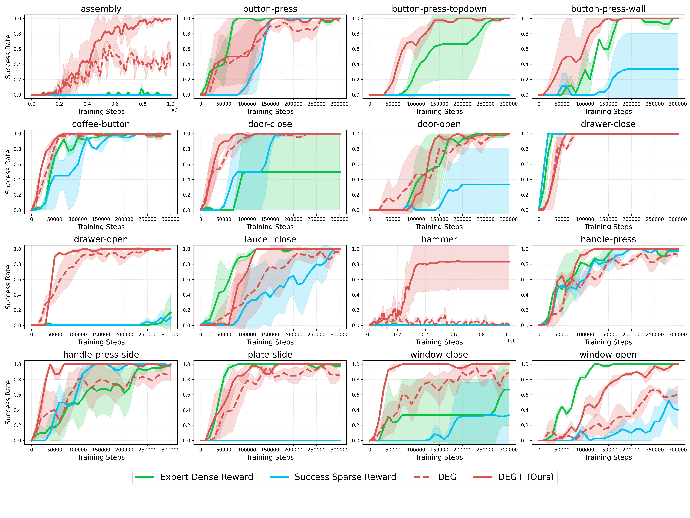

___

## Section8. Further reducing the videos used in DEG.

We further conducted additional experiments on the number of video clips. For drawer-open, less videos measn the number of videos is reduced from 3 to 1 (3->1). For coffee-button, the number is 5->3. DEG and DEG+ (DEG with success sparse reward) can also work well with less videos, while a bit more videos are better choice is possible. 

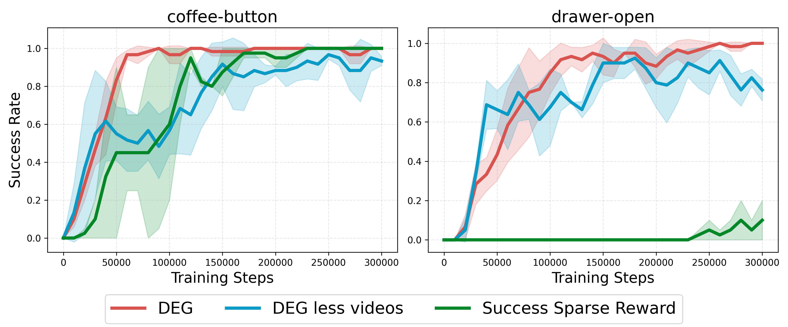
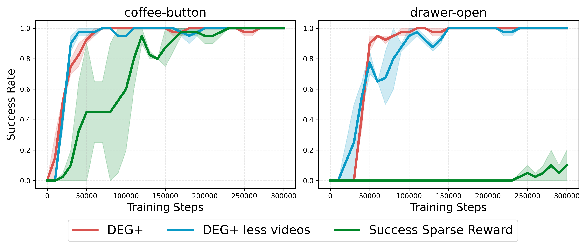

___

## Section9. Employing nearest neighbor rewards directly on videos.

We don't employ RL episodic guide, directly employing nearest expert video in DEG, marked as DEG no guide. Results demonstrate that episodic guidance is useful.

| task | DEG | DEG no guide|
|-|-|-|
| button-press-topdown    |  **0.80** |   0.57   |
| faucet-close |**0.93**| 0.33|

___

## Section10. combining DEG with RL backbone with higher exploration.

DrQv2, a value-based method built upon DDPG, employs a linearly decaying action std scale (from 1 to 0.1) to balance exploration and exploitation. We further modify the exploration strategy of the RL method to investigate DEG’s performance with a stronger exploration backbone. Specifically, we:

1. fixed the action sampling std of one to its maximum value of 1, marked with 'std = 1';
2. fixed the action sampling std to a larger value of 2, marked with 'std = 2'.

Under these two backbone variants, we validated the ability of DEG to improve performance when combined with sparse success rewards (i.e., the performance of DEG+). The results show that using a backbone with stronger exploration does improve the efficiency of exploring sparse success rewards, but its performance is still far inferior to that with DEG dense rewards.

| drawer-open-300k | DEG+ | Success Sparse Reward|
|-|-|-|
| std decaying (default)  |  **1.00** |   0.20  |
| std = 1 |**1.00**| 0.33|
| std = 2 |**1.00**| 0.67|

| drawer-open-100k | DEG+ | Success Sparse Reward|
|-|-|-|
| std decaying (default)  |  **1.00** |   0.00   |
| std = 1 |**1.00**| 0.00|
| std = 2 |**0.97**| 0.23|

___

## Section11. Numerical comparison between all methods on main tasks.

We summarize the quantitative performance of different methods on main tasks using a table.

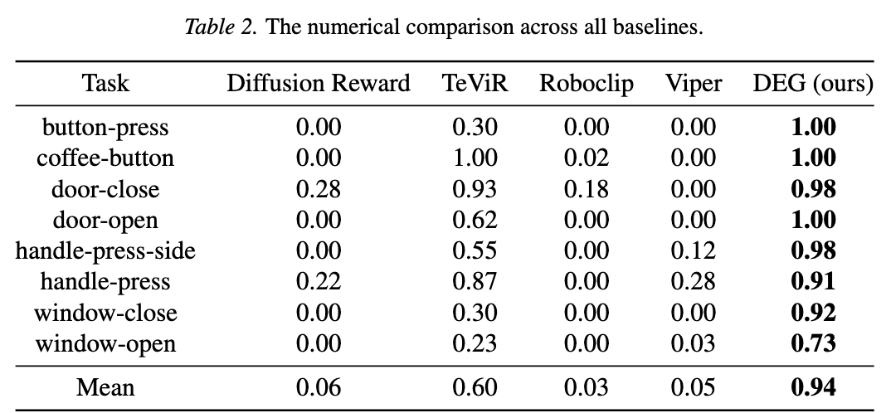

___

## Section12. Multitask ability of DEG.

We test the DEG's performance when faced with multiple tasks. We finetune a same RL guide for three different domains simultaneously: drawer-open, door-close, and coffee-button. This guide is used in all three tasks' RL process. The results demonstrate that DEG multitask can also conduct effective RL alone or improve the performance of Success Sparse Reward (i.e., DEG+).

| task| DEG | DEG multitask| 
|-|-|-|
| drawer-open |  1.00 | 1.00 | 
| door-close |1.00| 0.97|
| coffee-button |1.00| 1.00 |

| task| DEG+ | DEG+ multitask| 
|-|-|-|
| drawer-open |  1.00 | 1.00  |
| door-close | 1.00 | 1.00 | 
| coffee-button | 1.00| 1.00 | 

___

## Section13. Discussion of missed related works.

We expand the Related Work section with several missed approaches [1,2,3,4] to better position DEG.

[1] A vision-language-action-critic model for robotic real-world reinforcement learning.

[2] VLA-RL: Towards Masterful and General Robotic Manipulation with Scalable Reinforcement Learning

[3] Vla-rft: Vision-language-action reinforcement fine-tuning with verified rewards in world simulators

[4] NORA-1.5: A Vision-Language-Action Model Trained using World Modeland Action-based Preference Rewards

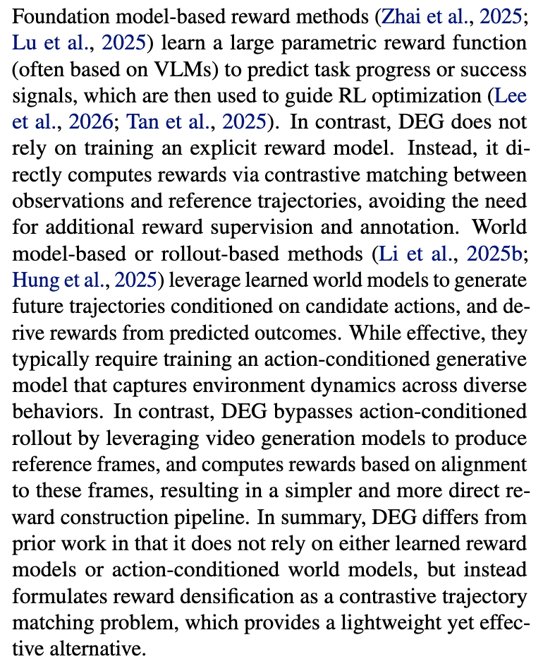

___

## Section14. We add additional baselines: Robodopamine and Roboreward.

We would like to note that these methods (VLAC, Robo-dopamine, VLA-RFT, and NORA1.5) are primarily designed for post-training or fine-tuning of VLA models, where the policy already exhibits a certain level of task competence. In contrast, DEG is designed for low-level control policy learning, where the reward function must provide meaningful guidance even under highly random initial behaviors (i.e., from scratch). This difference in setting makes direct comparison non-trivial, as some methods rely on reasonably good initial policies or stable rollouts to function effectively.

Considering that NORA 1.5 employs preference specified for large model for DPO rather than rewards, VLA-RFT requires several action-labeled trajectories for both wm training and rewards, we following your suggestions, comparing DEG with robodopamine. In addition, a contemporary Related work of robodopamine, roboreward, is also introduced as an additional baseline. These two are both large model-based reward design methods which can be easily decoupled from VLA, and they only require a few action-free videos for finetuning (or no requirements), making them more suitable for comparison. 

The comparison between DEG and roboreward on reward-free tasks is shown below, where DEG performs better across all reward-free tasks.
|Task|Roboreward|DEG|
|-|-|-|
|button-press|0.20|**1.00**|
|cofffee-button|0.07|**1.00**|
|door-close|0.57|**0.98**|
|door-open|0.00|**1.00**|
|drawer-close|0.47|**1.00**|
|drawer-open|0.00|**1.00**|
|faucet-close|0.13|**0.95**|
|handle-press|0.13|**0.91**|
|handle-press-side|0.07|**0.98**|
|plate-slide|0.00|**0.92**|
|window-close|0.00|**0.92**|
|window-open|0.00|**0.73**|

For Robodopamine, we employ the same expert videos (used in DEG) to construct the finetuning dataset and then finetune its pre-trained models on the target task, which follows its official instructions. Due to the short period of rebuttal and computation limitation, we only complete 6 tasks of Robodopamine by March 31. All results will be provided later. DEG also exhibits better performance across all tasks.

|Task|Robodopamine|DEG|
|-|-|-|
|button-press|0.10|**1.00**|
|cofffee-button|0.03|**1.00**|
|door-close|0.33|**0.98**|
|drawer-close|0.33|**1.00**|
|drawer-open|0.00|**1.00**|
|faucet-close|0.13|**0.95**|

	
___

## Section15. Visualization of generated videos without finetuning.

Without domain adaptation, the large model does not know that the drawer is fixed, yet it still maintains a reasonable understanding of the environment and the dynamics of the robotic arm.

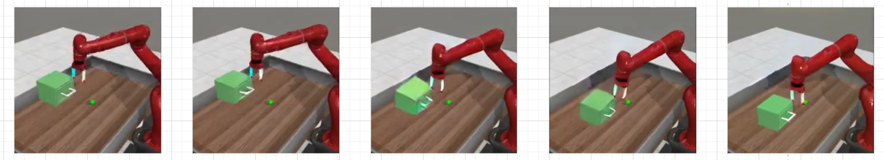

---
## Section16. More detailed discussion between related works and DEG

For reward-model or world-model based methods, what we intended to convey is that, unlike learning reward models or action-conditioned world models, we don't heavily modify the pre-trained model. Instead, we only use a little bit of data and the lightweight LoRA fine-tuning to adapt the model to the target task, fully exploiting and leveraging the inherent capabilities of the pre-trained video generation model itself. 

- In **VLM-based reward models**, since reward prediction is not a task that VLMs excel at, a dataset with sufficient quantity and diversity is required to elicit the model’s ability to predict rewards. 

- For an **action-conditioned world model** built upon video generation models, the data demand is even higher due to the introduction of action conditioning and the requirement for the model to further understand environmental dynamics.

- In contrast, the core objective of **DEG** is to drive policy training via the proposed dual-granularity contrastive reward based on the existing capabilities of the video generation model, rather than modifying the base model itself to endow it with stronger abilities to directly output rewards or future reconstruction. This key distinction enables DEG to effectively reduce the demand for data volume and training resources, and allows it to be easily and flexibly compatible with more advanced video generation models in the future, which is what we meant by “lightweight” in our previous description.

We believe this represents the main difference between our method and others in the utilization of foundation models, and we add the above more detailed discussion to the related work section based on your feedback.

---

## Section17. Analysis of roboreward & robodopamine results and training curves per trial.

Roboreward and Robodopamine exhibit mediocre performance in from-scratch RL on MetaWorld, which may be mainly attributed to the following reasons:

- **r1**. Distribution shift between the states during reward model training and those encountered at online RL. These methods are primarily designed for VLA fine-tuning, where most training data consists of successful trajectories or failed samples near successful ones. In contrast, learning low-level control from scratch involves a large number of random states rarely covered in their training data, which may lead to inaccurate reward predictions.

- **r2**. Lacking coverage of MetaWorld domains in pre-training data. Since reward prediction is not the inherent task of VLMs, the VLM-based reward model may require more data to align its pre-trained reward prediction capability to unfamiliar tasks.

- **r3**. Directly guiding online RL without any environmental feedback in single-camera MetaWorld is inherently challenging. Diffusion Reward is specifically designed for Metaworld, while it also demonstrates in its paper that it fails consistently on reward-free MetaWorld tasks. TeViR also struggles in the reward-free setting even with three camera views.

We provide the eval-score curve and train-value curves for different trials in robodopamine, to verify the soundness of our training process. During the late stage of training in Trial 1, the agent explored higher rewards and obtained higher values, then successfully learned an effective policy shortly afterward. This indicates that RL itself is functioning properly in our reproduction, and RoboDopamine also achieves decent discrimination between successful and failed trajectories. However, it may lack sufficient ability to distill useful information from low-quality trajectories in the early training phase (corresponding to **r1** above), which results in the failure in the other trials. In addition, insufficient domain coverage during reward model training (**r2**) and the inherent difficulty of reward-free MetaWorld tasks (**r3**) also negatively impacted its performance.

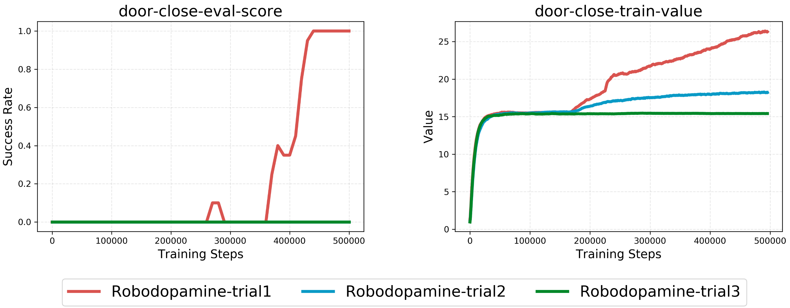

---

## Section18. Comparison with VLA-RFT reward.

We agree that VLA-RFT is an important work related to DEG. However, it was not initially included as a main baseline for comparison due to the following reasons.

- **First**, VLA-RFT conducts offline fine-tuning on large-scale action-labeled offline data, focusing on offline fine-tuning for VLAs without online interaction. DEG, by contrast, aims to improve online sampling efficiency and expert data efficiency for video imitation learning. Their research goals differ substantially.

- **Second**, VLA-RFT uses GRPO tailored for large models and VLA with prior policies. Methods such as DEG and diffusion reward design rewards for low-level control learning and support RL from scratch. Fair comparison under different policy initializations and RL backbones can be hard.

- **Third**, VLA-RFT relies on pretrained models and extensive offline action data, while DEG is distinguished by its extremely light use of expert data.

- **Fourth**, VLA-RFT uses many expert trajectories but has no online stage, so it cannot be evaluated by sampling efficiency—a key metric for DEG and baselines such as diffusion reward.

For these reasons, we did not include VLA-RFT as a main baseline. Instead, we used RoboDopamine and RoboReward, which can be naturally integrated with online RL and fairly compared under unified settings.

To address your concern, we conduct another comparison: we use VLA-RFT’s reward to guide online RL while keeping all other settings identical to DEG. This highlights the reward design differences and demonstrates DEG’s contribution. Since VLA-RFT requires a world model for RL, the real online environment serves as its optimal world model, which benefits its reward module and enables evaluation via sampling efficiency.

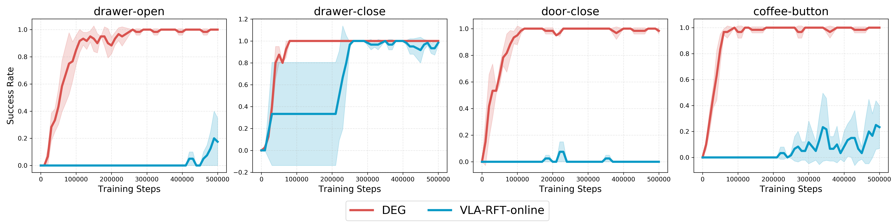

VLA-RFT-online refers to VLA-RFT combined with online RL.Unlike DEG, we do not employ a video generation model in VLA-RFT; instead, we directly provide sufficient expert videos.
DEG achieves superior policy performance across all tasks except drawer-close, and attains higher sample efficiency on all tasks. The reward mechanism of VLA-RFT, which directly matches sampled trajectories with expert videos frame‑by‑frame in temporal order, is specifically designed for VLA but not suitable for from‑scratch low‑level control policy training. It struggles to assign high rewards to high‑quality exploratory trajectory segments that are not temporally aligned with expert videos. For instance, if an expert video sequentially contains Trajectory 1, Trajectory 2, and Trajectory 3, the agent will not receive a reward if it explores Trajectory 1 during the period corresponding to Trajectory 2 when the policy is still immature. Furthermore, based on findings from previous studies [1], directly computing distances at the image level is not an efficient choice for standard online RL.

[1] Behavior From the Void: Unsupervised Active Pre-Training. NeurIPS 2021.

