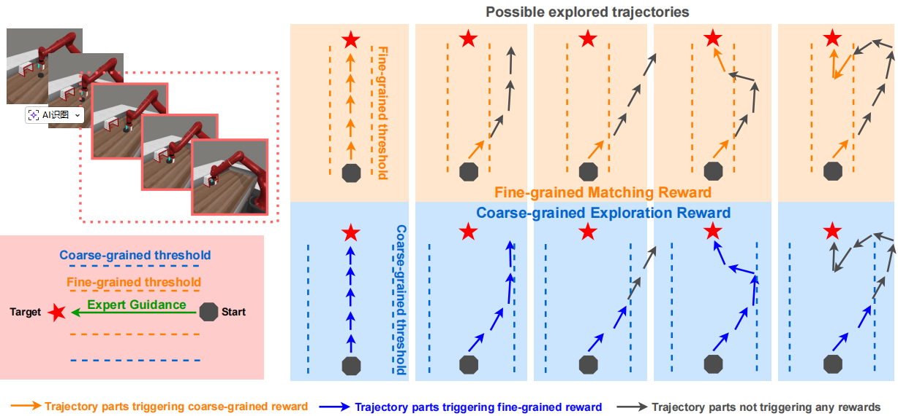

# ICML 15337 submission: Supplementary results of the proposed DEG in the rebuttal period

___

## Section1. Updating the reward diagram.

We further clarify the meanings of different symbols in the schematic diagram to illustrate (i) the differences between the two sub-rewards when applied to the same trajectory, and (ii) how each reward functions across different kinds of trajectories.

___

## Section2. More detailed encoder analysis.

We further provide more results and analysis on the DEG contrastive encoder and pre-trained DINOv3. We first present the performance of DINOv3 on video sequences with different frame intervals. DINOv3 exhibits slightly increased discrimination for frames with larger intervals (i.e., larger semantic distances), but the color distributions remain highly similar, indicating that it cannot adequately map semantic distances to similarity differences. In addition, the average cosine similarity of the first 11 semantically consistent real–generated image pairs encoded by DINOv3 is **0.9384 (far from 1)**, which means it suffers from the noise in generated videos. These disadvantages makes DINOv3 unsuitable for similarity-based reward design. 

In contrast, the DEG contrastive encoder shows significantly stronger discrimination for frame sequences with larger intervals, while maintaining the ability to align semantically identical frames over a wider temporal range. The first 11 semantically consistent real–generated image pairs encoded by DEG encoder is **0.9952**. Furthermore, for frames that are semantically close but distinct, DEG can effectively map their semantic distance to the similarity difference (heatmap of interval 1), thereby supporting the design of the proposed dual-granularity reward with different thresholds.

In summary, DEG encoder can better align frames with similar semantics and well map the semantic distances between different frames to their latent distances.

___

## Section3. DEG is robust to both seen and unseen episodes (initial states).

We visualize the used expert videos and generated RL episodes when faced with both seen and unseen initial states. DEG can well handle ood episodes and generates qualified RL gudiance.

Simulation:

Real-world tasks:

___

## Section4. Hyper-parameters sensitivity experiments.

Regarding the coefficients among different rewards, our goal was to scale them to a similar order of magnitude (range from 10 to 100), which results in good performance. We first change the weighing between coarse-grained reward and fine-grained reward, the results below demonstrate that a similar order of magnitude can better scale these two terms.

Then, we change the coefficient of the success sparse reward, as shown below. The larger weights results in better performance, which is consistent with our intuitation, while 10 is enough for effective learning.

___

## Section5. Prompt sensitivity experiments.

In the original paper, we provided as detailed a prompt as possible to maximize generation quality and verify the novel idea of using a large video generation model as an RL guide. In this section, we further conduct fine-tuning with very simple prompts. DEG and DEG+ (DEG with success sparse reward) can still perform effective RL guidance with very brief prompts ‘open the drawer’ and 'push the coffee machine button'.

___

## Section6. Experiments on harder tasks without success sparse rewards.

DEG still performs better than baselines on harder tasks without success sparse rewards.
| task | DEG | diffusion reward | viper|
|-|-|-|-|
| button-press-topdown    |  **0.60** | 0.33       |0.00|
|assembly|**0.37**| 0.00| 0.00 |

___

## Section7. Direct comparison between DEG and DEG+.

We include the DEG results in the DEG+ figure and directly compare them. With success sparse reward, our method can perform much better, which is consistent with intuiation.

___

## Section8. Further reducing the videos used in DEG.

We further conducted additional experiments on the number of video clips. For drawer-open, shorDEG and DEG+ can also work well with less videos, while more videos are better choice is possible. 

___

## Section9. Employing nearest neighbor rewards directly on videos.

We don't employ RL episodic guide, directly employing nearest expert video in DEG, marked as DEG no guide. Results demonstrate that episodic guidance is useful.

| task | DEG | DEG no guide|
|-|-|-|
| button-press-topdown    |  **0.80** |   0.57   |
| faucet-close |**0.93**| 0.33|

___

## Section10. combining DEG with RL backbone with higher exploration.

DrQv2, a value-based method built upon DDPG, employs a linearly decaying action std scale (from 1 to 0.1) to balance exploration and exploitation. We further modify the exploration strategy of the RL method to investigate DEG’s performance with a stronger exploration backbone. Specifically, we:

1. fixed the action sampling std of one to its maximum value of 1, marked with 'std = 1';
2. fixed the action sampling std to a larger value of 2, marked with 'std = 2'.

Under these two backbone variants, we validated the ability of DEG to improve performance when combined with sparse success rewards. The results show that using a backbone with stronger exploration does improve the efficiency of exploring sparse success rewards, but its performance is still far inferior to that with DEG’s dense rewards.

| drawer-open-300k | DEG+ | Success Sparse Reward|
|-|-|-|
| std decaying (default)  |  **1.00** |   0.20  |
| std = 1 |**1.00**| 0.33|
| std = 2 |**1.00**| 0.67|

| drawer-open-100k | DEG+ | Success Sparse Reward|
|-|-|-|
| std decaying (default)  |  **1.00** |   0.00   |
| std = 1 |**1.00**| 0.00|
| std = 2 |**0.97**| 0.23|

___

## Section11. Numerical comparison between all methods on main tasks.

We summarize the quantitative performance of different methods on main tasks using a table.

___

## Section12. Multitask ability of DEG.

We test the DEG's performance when faced with multiple tasks. We finetune a same RL guide for three different domains simultaneously: drawer-open, door-close, and coffee-button. This guide is used in all three tasks' RL process. The results demonstrate that DEG multitask can also conduct effective RL alone or improve the performance of Success Sparse Reward.

| task| DEG | DEG multitask| 
|-|-|-|
| drawer-open |  1.00 | 1.00 | 
| door-close |1.00| 0.97|
| coffee-button |1.00| 1.00 |

| task| DEG+ | DEG+ multitask| 
|-|-|-|
| drawer-open |  1.00 | 1.00  |
| door-close | 1.00 | 1.00 | 
| coffee-button | 1.00| 1.00 | 

___

## Section13. Discussion of missed related works.

We expand the Related Work section with several missed approaches [1,2,3,4] to better position DEG.

[1] A vision-language-action-critic model for robotic real-world reinforcement learning.

[2] VLA-RL: Towards Masterful and General Robotic Manipulation with Scalable Reinforcement Learning

[3] Vla-rft: Vision-language-action reinforcement fine-tuning with verified rewards in world simulators

[4] NORA-1.5: A Vision-Language-Action Model Trained using World Modeland Action-based Preference Rewards

___

## Section14. We add additional baselines: Robodopamine and Roboreward.

We would like to note that these methods (VLAC, Robo-dopamine, VLA-RFT, and NORA1.5) are primarily designed for post-training or fine-tuning of VLA models, where the policy already exhibits a certain level of task competence. In contrast, DEG is designed for low-level control policy learning, where the reward function must provide meaningful guidance even under highly random initial behaviors (i.e., from scratch). This difference in setting makes direct comparison non-trivial, as some methods rely on reasonably good initial policies or stable rollouts to function effectively.

Considering that NORA 1.5 employs preference specified for large model for DPO rather than rewards, VLA-RFT requires several action-labeled trajectories for both wm training and rewards, we following your suggestions, comparing DEG with robodopamine. In addition, a contemporary Related work of robodopamine, roboreward, is also introduced as an additional baseline. These two are both large model-based reward design methods which can be easily decoupled from VLA, and they only require a few action-free videos for finetuning (or no requirements), making them more suitable for comparison. 

The comparison between DEG and roboreward is shown below, where DEG performs better across all reward-free tasks.
|Task|Roboreward|DEG|
|-|-|-|
|button-press|0.20|**1.00**|
|cofffee-button|0.07|**1.00**|
|door-close|0.57|**0.98**|
|door-open|0.00|**1.00**|
|drawer-close|0.47|**1.00**|
|drawer-open|0.00|**1.00**|
|faucet-close|0.13|**0.95**|
|handle-press|0.13|**0.91**|
|handle-press-side|0.07|**0.98**|
|plate-slide|0.00|**0.92**|
|window-close|0.00|**0.92**|
|window-open|0.00|**0.73**|

For Robodopamine, we employ the same expert videos (used in DEG) to construct the finetuning dataset and then finetune its pre-trained models on the target task, which follows its official instructions. Due to the shor period of rebuttal and computation limitation, we only complete 6 tasks of Robodopamine by March 31. All results will be provided later. DEG also exhibits better performance across all tasks.

|Task|Robodopamine|DEG|
|-|-|-|
|button-press|0.10|**1.00**|
|cofffee-button|0.03|**1.00**|
|door-close|0.33|**0.98**|
|drawer-close|0.33|**1.00**|
|drawer-open|0.00|**1.00**|
|faucet-close|0.13|**0.95**|

	
___

## Section15. Visualization of generated videos without finetuning.

Without domain adaptation, the large model does not know that the drawer is fixed, yet it still maintains a reasonable understanding of the environment and the dynamics of the robotic arm.

